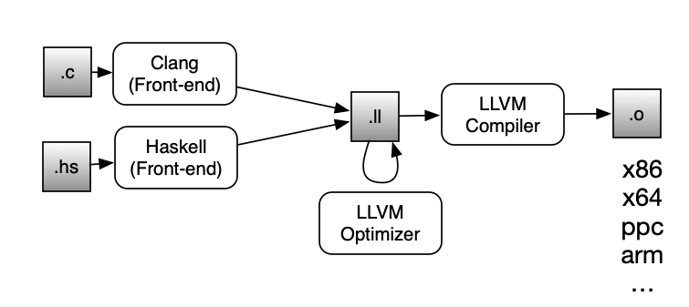

LLVM 10 Tutorial
================


por Alcides Fonseca <http://alcidesfonseca.com>


LLVM
----

O projecto LLVM (Low-Level Virtual Machine) consiste numa colecção de ferramentas para compilação que incluí diversos elementos, nomeadamente um compilador de C/C++ (Clang), um optimizador e um gerador de código. É um projecto Open-Source e recentemente impulsionado pela Apple como base para o XCode e desenvolvimento de apps para Mac e iOS.

Estes componentes são unidos por uma linguagem de representação intermédia de código (linguagem LLVM IR). Através desta linguagem intermédia, as ferramentas de optimização e geração de código para várias plataformas e arquitecturas podem ser reutilizadas por compiladores para várias linguagens. Esta ficha foca-se sobre essa linguagem.




Instalar o LLVM
----------------------

Em Ubuntu:

```bash
sudo apt-get install llvm
```

Em MacOS:

```bash
brew install llvm
echo "export PATH=/usr/local/opt/llvm/bin:\$PATH" >> ~/.bashrc
echo 'export PATH="/usr/local/opt/llvm/bin:$PATH"' >> ~/.zshrc # For Catalina
source ~/.bashrc
source ~/.zshrc # Catalina
```

Para verificar que está tudo operacional:

```bash
bash check.sh
```

Verificar que estamos a usar a versão certa:

```bash
llc --version
```

O resultado deve ser  LLVM version 10.0.0

Executar o Hello World
-----------------

Junto a este documento encontra-se um ficheiro chamado hello.ll. Esse ficheiro contem um exemplo de um Hello World escrito em LLVM. Para o executar directamente, poderá usar o LLVM Interpreter (lli). Para tal basta executar no terminal: `lli hello.ll`. Deverá aparecer "Hello World" no stdout como resultado da execução do código LLVM.

Para compilar o código para um ficheiro objecto são necessários dois passos. O primeiro consiste em executar o LLVM Compiler (llc) usando o comando: `llc hello.ll`. Este passo vai gerar um ficheiro assembly hello.s. O segundo passo consiste em usar um compilador como o gcc ou o clang para gerar o executável. Para tal deverá escrever no terminal: `clang -o hello hello.s`. O ficheiro final poderá ser executado correndo `./hello`.


Um ficheiro vazio
-----------------

O ficheiro empty.ll é o ficheiro mínimo que contem um ficheiro executável. O ficheiro define apenas uma função main que devolve o valor 0, não fazendo mais nada. Serve como exemplo de como se define uma função. Usa-se a syntax `define <tipo> @nome_da_funcao([argumentos])` seguido do corpo da função caso seja uma definição. Caso seja uma declaração (como é o caso do printf, no exemplo de helloworld, o corpo não é necessário).

```llvm
define i32 @main() {
  ret i32 0
}
```


Tipos
-------------

Uma das primeiras coisas que teremos de considerar é o tipo de dados usados. Os inteiros são representados por iX, sendo X o número de bits que o inteiro usa. Por exemplo: i32 e i64 usam 32 e 64 bits cada. Para além de inteiros existem outros tipos primitivos como float (32 bits), double (64 bits). 

Tal como em C, podemos também ter ponteiros para tipos primitivos. Como exemplos podemos ter: `i32*` (ponteiro para um inteiro) ou `i32 (i32) *` (ponteiro para uma função que recebe um inteiro e devolve um inteiro).

Podemos ainda ter arrays, úteis para representar um conjunto de dados do mesmo tipo, seguindo a syntax `[ N x <type>]`. Por exemplo `[40 x i32]` é um array de inteiros de tamanho 40.
  


Operações sobre tipos nativos
-----------------------------


```llvm
define i32 @main() {
  %1 = mul i32 2, 8
  %2 = add i32 %1, 2
  ret i32 %2
}
```


Neste exemplo, a função main já faz alguns cálculos. Na primeira linha guarda na variável %1 o resultado da multiplicação da constante 2 por 8 (16). Em LLVM IR, as variáveis começam por % se forem locais ou @ se forem globais. A operação de multiplicação de inteiros chama-se mul e, tal como outros operadores binários, tem a syntax: `mul <tipo> op1, op2` sendo tipo o tipo de dados a operar, op1 e op2 os operandos. Neste caso os operandos são os dois constantes. Para além de números, true e false são também aceites como constantes do tipo `i1` (correspondente ao boolean).

Na segunda linha, voltamos a fazer uma operação (adição) usando uma constante (2) e o resultado da operação anterior (%1). Para além do mul e add, existem também as operações sub (subtracção), udiv (divisão inteira), urem (módulo da divisão inteira).

Em termos de operações de bitwise, temos também os operadores and e or com a mesma syntax. Em termos de operações de comparação, existe o operador icmp que tem uma syntax ligeiramente mais complexa: `icmp <comp> <tipo> op1, op2`. O comparador a usar (comp) pode ser um da seguinte lista: eq (==), ne (!=), sgt (`>`), sge (`>=`), slt(`<`) e sle(`<=`). A expressão devolve true ou false conforme a comparação seja verdadeira ou não.

Outra característica do LLVM IR é que é SSA (Static Single Assignment), o que implica que uma variável não pode ser definida duas vezes. Para testar, volte a redefinir %1 antes da expressão de retorno, e veja que o código fica inválido. Apesar das variáveis poderem ter vários nomes, o código gerado costuma usar %1, %2, %3, etc... para expressões intermédias.


Leitura e escrita de variáveis
---------------------------

Se as variáveis LLVM não podem ser reescritas, como modelar as variáveis de linguagens como C, onde os seus valores podem ser alterados mais à frente no programa?


A solução passa por guardar numa variável LLVM um ponteiro para um espaço na memória que pode ser lido e escrito com o load e store.

```llvm
%p_a = alloca i64
````

O operador alocca consegue reservar espaço da memória para uma variável de um determinado tipo. No registo `%p_a` é guardado um ponteiro para esse espaço (`i64*` neste caso).

```llvm
store i64 3, i64* %p_a
````

O operador store guarda um valor (3 neste caso) num espaço de memória apontado por um outro valor (`%p_a` neste caso).

```llvm
%b = load i64, i64* %p_a
````

Load faz o oposto, lê o valor que está nesse espaço de memória e coloca-o na variável `%b`. Esta instrução permite-nos ler o valor em diferentes pontos do programa, existindo a possibilidade dos valores serem diferentes conforme o número de stores que existam pelo meio.


Operações sobre Arrays
---------------------------

```llvm
define i32 @main() { 
  %arr = alloca i32, i32 3
  ;
  %ind0 = getelementptr i32, i32* %arr, i32 0
  store i32 9, i32* %ind0
  ;
  %ind1 = getelementptr i32, i32* %arr, i32 1
  store i32 8, i32* %ind1
  ;
  %ind2 = getelementptr i32, i32* %arr, i32 2
  store i32 7, i32* %ind2
  ;
  %ind1v = load i32, i32* %ind1
  ret i32 %ind1v
}
```

Neste exemplo, %arr é um array alocado dinamicamente com o tamanho 3 (apesar da constante 3 poder ser substituída pelo resultado de outra computação com %variavel). A primeira linha trata da alocação do espaço necessário para o array. O operador getelementptr (GEP) vai buscar o endereço de memória onde está guardado o elemento 0 do array %arr. Nas linhas seguintes irá buscar o índice 1 e 2. Em cada store é guardado um número (9, 8 e 7 respectivamente) no endereço de memória respectivo ao indíce.

Finalmente a instrução load vai buscar o valor guardado em memória no índice 1. O load tal como o store actuam em ponteiros de memória, que têm de ser obtidos previamente com o getelementptr.

Operações sobre Estruturas
---------------------------

Uma forma de implementar estruturas e objectos é usando tipos compostos. Para este exemplo vamos considerar um array de Java, que para além de um ponteiro para o array nativo, tem também um campo onde é guardado o número de elementos existentes. Para tal é conveniente declarar no topo do ficheiro um alias para o tipo composto. No caso do exemplo a seguir, declaramos dois tipos, um para arrays de inteiros e outro para arrays de booleans. Em ambos o primeiro campo é um inteiro, onde se guarda o tamanho actual do array.

A estrutura constroí-se através da primeira chamada ao inservalue. A syntax é `insertvalue <type> <input>, <vtype> <value>, <pos>`, o que corresponde a colocar value no campo pos do input. Em Java ou C, seria equivalente a input.pos = value, em que type seria o tipo da estrutura e vtype o tipo do campo. Caso o input seja `undef`, é criado uma nova estrutura em memória. Com chamadas encadeadas, é preenchido o elemento passo a passo, até fichar completo.

```llvm
%IntArray = type { i32, i32* }
%BooleanArray = type { i32, i1* }
;
@a = global %IntArray { i32 0, i32* null} 
;
define i32 @main() { 
  %size = add i32 0, 3
  ;
  %arr = alloca i32, i32 %size
  %arr_ins = insertvalue %IntArray undef, i32 %size, 0
  %arr_ins2 = insertvalue %IntArray %arr_ins, i32* %arr, 1
  store %IntArray %arr_ins2, %IntArray* @a
  ;
  %arr_load = load %IntArray, %IntArray* @a
  %length = extractvalue %IntArray %arr_load, 0
  ;
  %store_load = load %IntArray, %IntArray* @a
  %store_arr = extractvalue %IntArray %store_load, 1
  %ind0 = getelementptr i32, i32* %store_arr, i32 1
  store i32 9, i32* %ind0
  ;
  ret i32 0
}
```


A instrução extractvalue serve para ler um valor de uma estrutura, ou tipo composto. A syntax é `extractvalue <type> <input>, <pos>` em que corresponde a ler input.pos, em que type é o tipo da estrutura a ler. No exemplo, esta instrução é usada primeiramente para obter o valor do tamanho do array, e posteriormente para obter o ponteiro para o array, a partir do qual se pode ler ou escrever para o array usando o getelementptr, stores e loads.


Definição e Chamada de Funções
---------------------------

Como já vimos, as funções podem ser definidas usando o operador define. A seguir temos um exemplo de algumas funções a serem chamadas.

```llvm
define i32 @sum(i32 %a, i32 %b, i32 %c) {
    %1 = add i32 %a, %b
    %2 = add i32 %1, %c
    ret i32 %2
}
define i32 @main() {
  %1 = call i32 @sum(i32 1, i32 2, i32 3)
  call i32 (i32, i32, i32)* @sum(i32 1, i32 2, i32 3) ; alternative call syntax
  ret i32 %1
}
```

Em primeiro lugar definimos a função sum, que recebe três inteiros e devolve a soma desses 3 inteiros. Como vimos anteriormente, primeiro temos de somar os dois primeiros valores (guardando em %1), somamos esse resultado intermédio com o último valor e devolvemos a soma total. De notar que os argumentos são declarados com os tipos.

Na função main estamos a invocar essa função com o operador call. A syntax de chamada é ` call <tipo_de retorno> <funcao>(<args>) `. Para os argumentos é também necessário declarar o tipo de cada um destes. Os tipos explícitos ajudam a detectar inconsistências no código.
  
Existe uma versão alternativa, onde o retorno da função não é usado, e nesse caso podemos usar o tipo da função (incluindo parâmetros e referência no final) em vez do tipo de retorno.

Operações de Ramos (Branching)
------------------------------

```llvm
define i32 @main() {
entry:
  %v1 = add i32 0, 3
  %v2 = add i32 0, 2
  %ifcond = icmp eq i32 %v1, %v2
  br i1 %ifcond, label %then, label %else
then:
  %calltmp = add i32 %v1, %v2
  br label %ifcont
else:
  %calltmp1 = mul i32 %v1, %v2
  br label %ifcont
ifcont:
  %iftmp = phi i32 [ %calltmp, %then ], [ %calltmp1, %else ]
  ret i32 %iftmp
}
```

As operações de ramos (como o if, for e while) são mais complexas em LLVM IR. Como se pode ver, a função está partida em diferentes secções, cada uma com a sua label: entry, then, else, ifcont. A label entry é aquela onde a função entra por default e coloca-se logo no início da função. Na variável %ifcond é guardado caso as variáveis %v1 e %v2 sejam iguais ou não. A expressão br é responsável por saltar para a label %then caso seja verdade, ou para a label %else caso o valor seja false. Poderão ver a expressão br como um goto condicional a uma variável.

No ramo then, são somados os dois valores iniciais e no ramo else estes são multiplicados. No final de cada um dos dois ramos é feito um salto (goto) através de um br não condicional para uma label %ifcont. O motivo para tal é que pode apenas existir uma expressão ret numa função.

Na label ifcont é usado o operador phi para ir buscar o valor correcto. Este operador especial permite selecionar um valor através do ramo percorrido pelo programa. É uma forma de permitir usar valores que podem ter sido modificados por um ramo ou outro. 


Exercícios
---------------------------

* Escrever um programa que devolva a soma dos 100 primeiros números inteiros. Para tal deverá fazer uma estrutura de controlo semelhante a um ciclo while.
* Escrever um programa com a função de Fibonacci definida de forma recursiva.

Soluções
---------------------------

Uma forma bastante simples de obter o código IR que se desconhece é escrever o código respectivo em C e usar o clang para compilar para LLVM-IR. Para tal basta executar no terminal `clang -S -emit-llvm cheat.c`. Poderão reparar que o ficheiro cheat.ll resultante está cheio de metadados e atributos opcionais nos operadores, resultado de uma optimização. Poderão ignorar quase todos esses atributos e reduzir o código à forma mais elementar das expressões.


Referências
-------------

* [LLVM Language Reference Manual](http://llvm.org/docs/LangRef.html)
* [Mapping High-Level Constructs to LLVM IR](http://llvm.lyngvig.org/Articles/Mapping-High-Level-Constructs-to-LLVM-IR)
* [LLVM Tutorial](http://llvm.org/docs/tutorial/LangImpl5.html)
